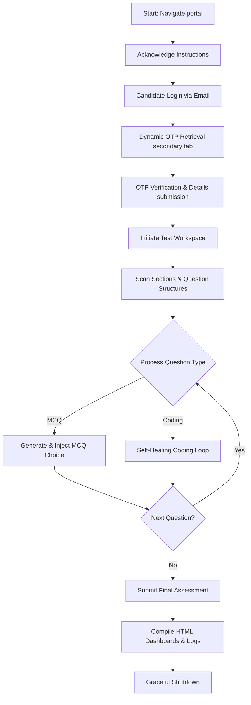
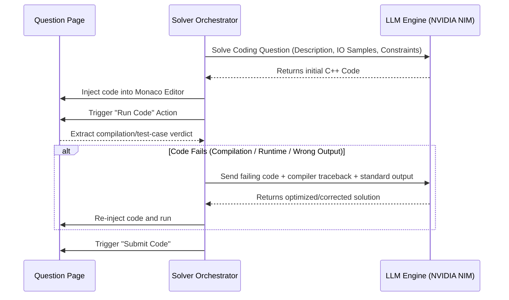

# 🤖 Automated Online Assessment Testing & Solver Framework

[](https://www.python.org/)
[](https://www.selenium.dev/)
[](https://opensource.org/licenses/MIT)

An enterprise-grade, highly resilient **Automated Testing, Interaction, and Solver Framework** designed to navigate, scan, and autonomously solve dynamic web-based online assessments. 

By combining the **Page Object Model (POM)** architectural pattern with thread-safe WebDriver orchestration and an **intelligent self-healing LLM feedback loop**, this framework can bypass proctoring controls, dynamically extract complex MCQ/Coding instructions, handle real-time Multi-Factor Authentication (OTP), and inject highly optimized coding solutions in real-time.

---

## 🛠 System Architecture & Flow

The framework orchestrates a multi-phase pipeline that automates candidate lifecycle transitions:



---

## 📂 Core Directory & File Structure

```
.
├── config/
│   ├── __init__.py
│   └── settings.py          # Unified settings, credentials, timeouts, and env loaders
├── pages/
│   ├── __init__.py
│   ├── base_page.py         # Parent page wrapper with thread-safe driver & wait wrappers
│   ├── candidate_details_page.py # Fills candidate details (Name, Roll, Mobile)
│   ├── instructions_page.py # Bypasses instructions & accepts declarations
│   ├── login_page.py        # Automates candidate login & OTP insertion
│   ├── question_page.py     # Main answering engine (handles MCQ parsing & Monaco injection)
│   ├── start_test_page.py   # Triggers and clicks start test action
│   └── summary_page.py      # Scans section lists, structural counts, and progress
├── utils/
│   ├── __init__.py
│   ├── driver_factory.py    # Anti-fingerprint Chrome setup & browser bypass hooks
│   ├── llm_solver.py        # NVIDIA NIM / OpenAI API broker with prompt engineering
│   ├── logger.py            # Unified system stream and file logging pipeline
│   ├── otp_fetcher.py       # Multi-tab Yopmail scraper to bypass active OTPs
│   ├── report_generator.py  # Generates professional HTML telemetry dashboards
│   └── selenium_helpers.py  # Safe-click, dynamic scroll, and explicit wait wrappers
├── README.md                # Full-fledged project documentation
├── main.py                  # Main orchestration driver script
└── requirements.txt         # Project requirements (Selenium, WebDriver-Manager, OpenAI)
```

---

## 🚀 Key Technical Capabilities & Algorithms

### 🔐 1. Dynamic Multi-Tab OTP Fetching
Rather than using static mock parameters, the system manages a secondary browser context to solve live OTP tests:
- Automatically launches a secondary tab in the active browser session.
- Navigates to a temporary email service (Yopmail), utilizing a custom-built dynamic DOM selector sequence to poll and scrape the latest OTP.
- Focuses back on the primary test window, injects the credentials, and proceeds without terminating session tokens.

### 🎯 2. Resilient MCQ Selector Parsing
To bypass dynamic selector names, randomized IDs, and shadow DOM changes, the framework employs an evaluation engine:
- Traverses five diverse XPath configurations utilizing text sibling axes and relative label-parent mapping.
- Utilizes proximity scans to locate radio/checkbox controls closest to matching string labels if traditional selectors are missing or dynamic.

### 💻 3. Monaco / CodeMirror Editor Injection
Interactive questions rely on advanced editor panes that block direct clipboard text paste events. The framework bypasses this via:
1. **API Direct Injection**: Evaluates javascript handles directly on the browser's global scope (`monaco.editor` and `CodeMirror`) to update content parameters instantly.
2. **Keyboard Sequence Fallback**: Resolves to active focus-grabbing triggers, clipboard buffering, and sequential platform-independent key combinations to copy-paste solutions reliably.

### 🔄 4. Dynamic Self-Healing Code Solver Loop
Generative AI code can sometimes fail against hidden compiler constraints. The framework embeds an active self-healing feedback loop:



### 👤 5. Proctoring Bypass & Anti-Fingerprinting
Online proctoring scripts monitor tab switching and blurred windows. The framework injects a custom **Chrome DevTools Protocol (CDP)** javascript payload upon every new page load that:
- Overrides `document.visibilityState` to always return `"visible"`.
- Spoof `document.hidden` to always return `false`.
- Intercepts and drops event listeners tracking `blur`, `focusout`, `mouseleave`, `visibilitychange`, and clipboard operations (`copy`, `cut`, `paste`).
- Emulates perpetual full-screen states.

---

## ⚙️ Environment Configuration

Configuration is managed globally in `config/settings.py` and can be customized locally via a `.env` file.

### Local Settings Configuration (`.env`)
Create a `.env` file in the root directory:
```bash
# Primary NVIDIA NIM API Key (starts with nvapi-)
NVIDIA_NIM_API_KEY=your_primary_nvidia_key

# Optional fallback key to use when primary hits quota limits
NVIDIA_NIM_API_KEY_FALLBACK=your_fallback_nvidia_key

# Target NVIDIA NIM Model (e.g., meta/llama-3.3-70b-instruct)
NVIDIA_NIM_MODEL=meta/llama-3.3-70b-instruct

# NVIDIA NIM Base API URL
NVIDIA_NIM_BASE_URL=https://integrate.api.nvidia.com/v1

# Manual execution verification (set to true to pause before submits)
MANUAL_MODE=false
```

---

## 🏁 Getting Started (Local Development)

### 📋 Prerequisites
- **Python**: Version 3.8, 3.9, or 3.10.
- **Google Chrome**: Ensure a standard version of Google Chrome is installed on your local host machine.

### 💻 Local Run Steps
1. **Clone the repository**:
   ```bash
   git clone <repository-url>
   cd <repository-directory>
   ```

2. **Set up a Virtual Environment**:
   ```bash
   python -m venv .venv
   # On Windows:
   .venv\Scripts\activate
   # On macOS/Linux:
   source .venv/bin/activate
   ```

3. **Install Dependencies**:
   ```bash
   pip install -r requirements.txt
   ```

4. **Verify environment and launch**:
   ```bash
   python main.py
   ```

---

## 📊 Summary Dashboards & Outputs

At the end of every execution run, the system compiles the captured metrics and logs into a professional, lightweight **HTML Telemetry Dashboard** (`reports/assessment_dashboard.html`).

### The dashboard features:
- **Timeline Overview**: Step-by-step logs highlighting exact transition timestamps (Login, OTP fetch, Section scans, Submissions).
- **Execution Telemetry**: Accurate counters for MCQ vs. Coding questions, highlighting passed and failed iterations.
- **Detailed Audits**: Comprehensive sections detailing the generated C++ codes, self-healing traceback outputs, and choice selections.

---

## 🔧 Troubleshooting

#### 1. Headless Mode Crashing
* **Problem**: The automation crashes during browser startup in server/non-UI environments.
* **Fix**: Ensure `--no-sandbox` and `--disable-dev-shm-usage` are passed to Chrome options (handled automatically by `utils/driver_factory.py`).

#### 2. Model Quota / API Errors
* **Problem**: Prompt queries to the generative AI solver fail or error out.
* **Fix**: Ensure your primary `NVIDIA_NIM_API_KEY` is active and correct. You can specify an optional `NVIDIA_NIM_API_KEY_FALLBACK` key to handle rate limits or query quota depletion.
